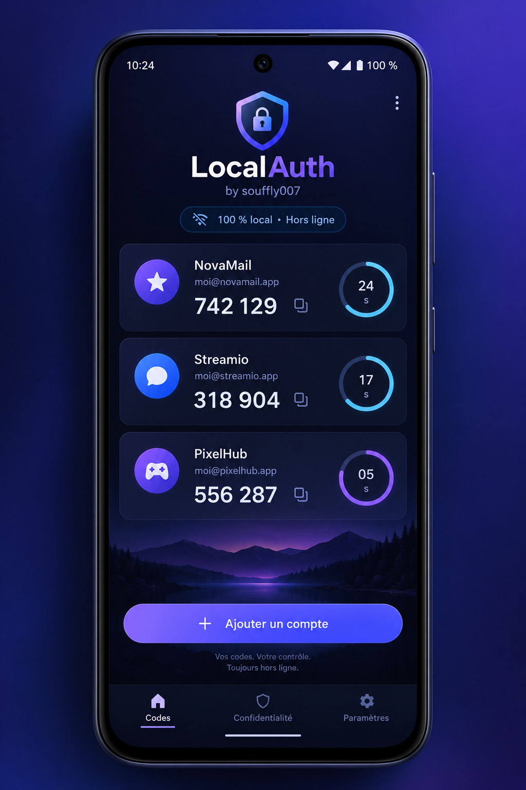

# LocalAuth by souffly007

Authentificateur TOTP Android hors ligne et respectueux de la vie privée.

## Version 1.1.0 bêta 1

- génération TOTP RFC 6238 hors connexion ;
- secrets chiffrés en AES-256-GCM ;
- clé conservée dans Android Keystore et non exportable ;
- base locale Room sans permission Internet ;
- captures et enregistrement d'écran bloqués (`FLAG_SECURE`) ;
- ajout manuel, copie rapide et suppression des comptes ;
- scan des QR `otpauth://` et migration Google Authenticator ;
- import JSON LocalAuth et Aegis non chiffré ;
- import Proton Authenticator JSON, avec ou sans mot de passe ;
- export/restauration JSON chiffré par mot de passe (PBKDF2-SHA256 + AES-256-GCM) ;
- détection des doublons pendant chaque import ;
- icône bouclier bleu/cyan avec clé numérique ;
- paysage nocturne montagne/lac intégré en arrière-plan avec voile de lisibilité ;
- identité visuelle cyan, noms vert fluo, codes orange fluo et compte à rebours circulaire ;
- cartes translucides et décompte circulaire vert/orange/rouge sans suffixe ;
- verrouillage par PIN local à 6 chiffres et empreinte biométrique ;
- chiffrement AES-256-GCM de toutes les métadonnées sensibles (service et identifiant) avec migration automatique de la base 1.0 ;
- test officiel RFC 6238 inclus.

## Compiler

Ouvrir le dossier dans Android Studio, laisser la synchronisation Gradle se terminer puis lancer `assembleDebug`.

Le projet utilise explicitement la toolchain Java 17 pour Java, Kotlin et KSP.

## Sécurité

La sauvegarde portable ne réutilise jamais la clé Android Keystore, car celle-ci est volontairement liée au téléphone. Elle dérive une clé distincte depuis le mot de passe choisi. LocalAuth ne propose pas d'export non chiffré afin d'éviter une fuite accidentelle des secrets. Les sauvegardes Aegis déjà chiffrées doivent d'abord être exportées en JSON lisible depuis Aegis ; LocalAuth les rechiffre ensuite dans son propre format.
